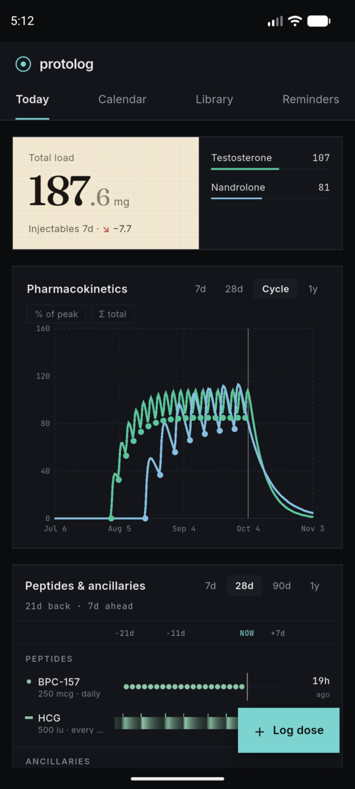
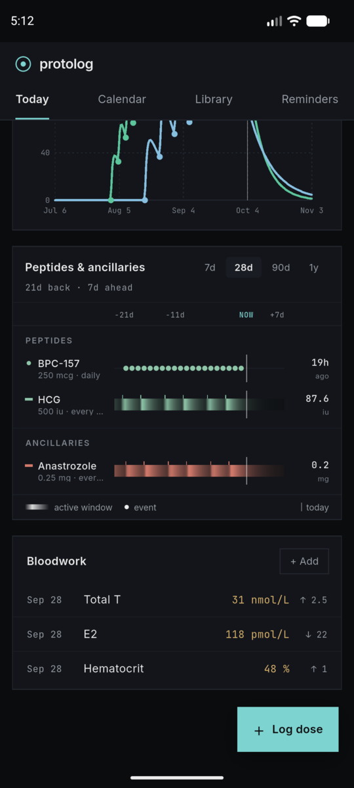
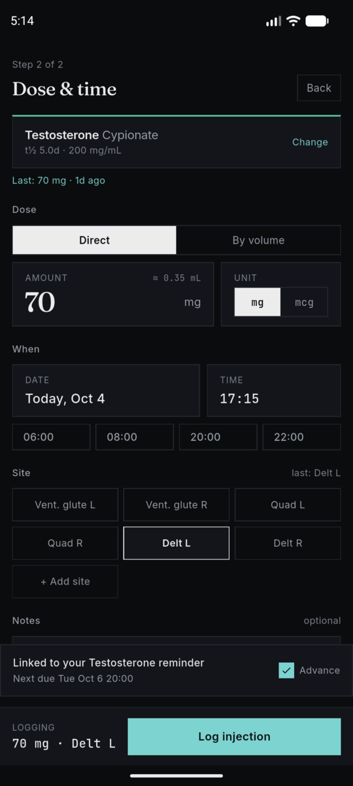
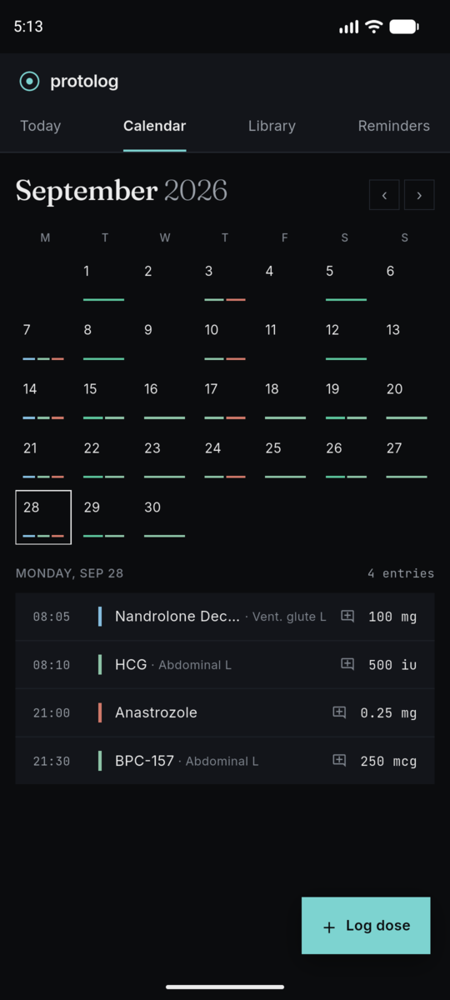
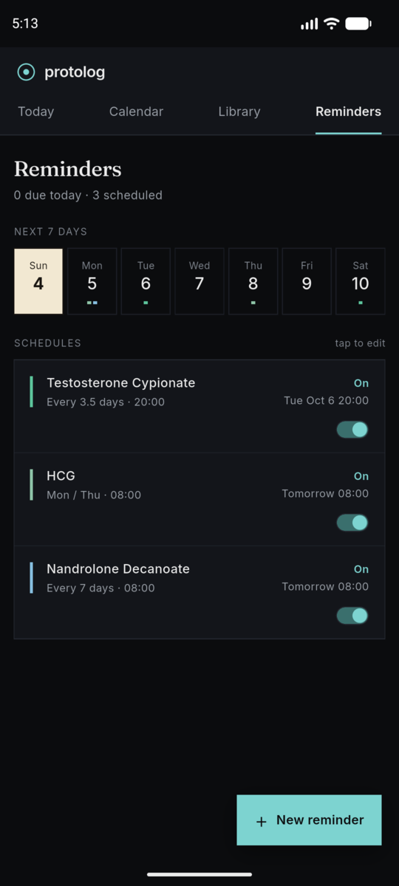
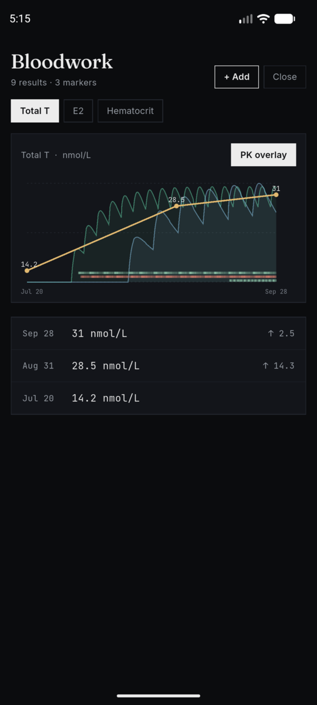
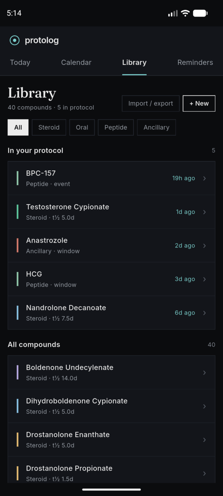
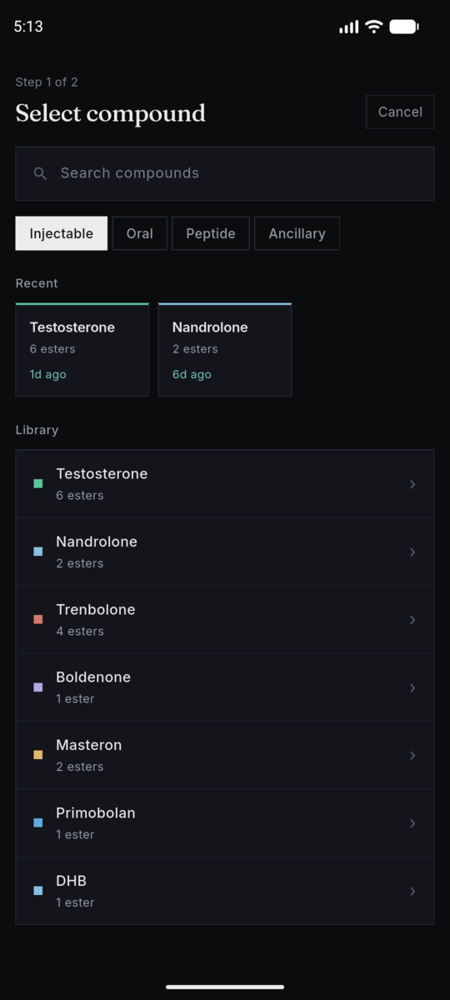

# ProtoLog 🧬

ProtoLog is a mobile tracking app built with **Flutter** for managing and visualizing protocols for anabolic compounds, peptides, and ancillaries. It estimates active blood-serum levels over time with a pharmacokinetic (PK) plotter based on the Bateman equation.

The interface uses a custom **"Lab Sheet"** design system (near-black surfaces + warm cream paper accents, top-tab navigation with a floating action button) applied across all screens — **Today, Calendar, Library, Reminders, and Bloodwork**.

## 📸 Screenshots

<table>
  <tr>
    <td></td>
    <td></td>
    <td></td>
    <td></td>
  </tr>
  <tr>
    <td></td>
    <td></td>
    <td></td>
    <td></td>
  </tr>
</table>

<sub>Screenshots use demo data.</sub>

## 🚀 Features

- **Pharmacokinetic plotter**
    - Ester release curves via the Bateman equation, from each log's frozen PK snapshot.
    - Handles blends like **Sustanon** and **Tri-Tren** (modelled from their component esters).
    - **Dual-axis graphing** — orals scaled separately from injectables.
    - **Peptide / ancillary swimlanes** — active-window saturation bars or event markers.
    - **% of peak / Σ total** chart modes; 7d / 28d / Cycle / 1y ranges.
    - **Total load** hero with a per-compound breakdown and a 7-day trend.
- **Dose logging**
    - Steroids (injectable/oral), peptides, and ancillaries, in mg / mcg / IU.
    - **Direct or by-volume** entry with a vial **reconstitution calculator** (U-100 syringe units for peptides).
    - Prefills your last dose *and* unit, last injection site, and a sensible time; **soft warning** when a dose is way off your last one.
    - Injection-site picker with your own custom sites; notes per log.
    - Logging from the Calendar pre-fills the selected day; **edit logs in place** from the Calendar.
- **Compound library**
    - Pre-loaded compounds with half-lives and ester weights; create custom compounds or edit built-ins (reset-to-default, optional rewrite of past logs).
    - Validated PK inputs (half-life, time-to-peak, yield) so curves stay sane.
- **Bloodwork**
    - Log lab draws (marker, value, unit, date); the dashboard card shows the latest draw per marker with change vs. the previous one.
    - Per-marker trend page with an optional **PK overlay** — each compound's modelled activity behind the trend line.
- **Reminders**
    - **Interval** schedules (incl. fractional, e.g. every 3.5 days) or **custom weekday** schedules; DST-safe.
    - Overdue / Due / On / Paused states, next-dose estimate, and a 7-day agenda strip.
    - **Log now / Skip** from the list *or* right on the notification; logging a dose advances the matching reminder.
    - Exact alarms where permitted; a banner tells you if notifications are turned off.
- **Backup & restore** — export everything (compounds, logs, reminders, bloodwork) to a file via the share sheet; restore merges it in and shows exactly what it will add or replace. Markdown export/import of the log via the clipboard.
- **Privacy** — all data stays on the device (`shared_preferences`); the release build has no internet permission and opts out of Android cloud backup.
- **Accessibility** — screen-reader labels and chart summaries, 48 dp touch targets, readable contrast, and layouts that hold up at large font sizes.

## 📦 Install

Signed Android APKs are published under [GitHub Releases](https://github.com/shamanchikq/protolog/releases). Download the latest `protolog-*.apk` and sideload it (Android will ask to allow installs from your browser/file manager the first time). New versions install over the old one and keep your data — still, make a backup first (Library → Import / export → Back up everything to file).

Requires Android 7.0+.

## 🛠️ Building from source

1. Install the [Flutter SDK](https://docs.flutter.dev/get-started/install) (developed on Flutter 3.47).
2. `flutter pub get`
3. `flutter run` (debug) or `flutter build apk --debug`

Release builds (`flutter build apk`) need the upload keystore and `android/key.properties` (not in the repo); without them the build stops early with instructions.

## 🧱 Project Structure

State is managed with `setState` + `shared_preferences` (no state-management package). PK math lives in top-level functions so it can run inside `compute()` isolates.

- `lib/main.dart` — app entry and `MainScreen` (state owner, tab routing, mutation + persistence glue).
- `lib/models.dart` · `lib/data.dart` — data models / JSON, and the built-in compound library.
- `lib/engine/` — pure, unit-tested logic: PK math (`compute_engine`), dashboard stats, library helpers, dose ↔ volume math, the log wizard's draft logic, reminder scheduling + notification planning, DST-safe calendar helpers, backup / migrations / validation, Markdown import-export, bloodwork stats.
- `lib/services/` — platform wrappers: storage (`app_store`), reminder notifications, backup I/O, custom injection sites.
- `lib/ui/` — the Lab Sheet theme, shared widgets (shell, charts, swimlanes, cards, tap targets) and screens (`views/`, with the log wizard split into `views/wizard/`).

## 🧪 Tests

```
flutter test                     # ~970 unit + widget tests
TZ=Europe/Kyiv flutter test      # DST-sensitive tests only bite in a zone with DST
flutter analyze
```

CI (GitHub Actions) runs analysis, the test suite in UTC and Europe/Kyiv, and a debug APK build on every push.

## 📱 Dependencies

- `shared_preferences` — local storage.
- `flutter_local_notifications` + `timezone` + `flutter_timezone` — scheduled, timezone-aware reminders.
- `share_plus` + `file_selector` + `path_provider` — backup export and restore.
- Inter / Fraunces / JetBrains Mono are **bundled** under `assets/fonts/` (no `google_fonts`).
- `flutter_launcher_icons` (dev) — app icon generation.

## 🎨 Customization

- Default compounds: `BASE_LIBRARY` in `lib/data.dart` — or edit built-ins in-app.
- PK math: the top-level functions in `lib/engine/compute_engine.dart`.
- Visual tokens (palette, fonts, per-compound colours): `lib/ui/theme.dart`.

## ⚠️ Disclaimer

ProtoLog's curves are mathematical **estimates** from published half-lives — not measurements and not medical advice.
